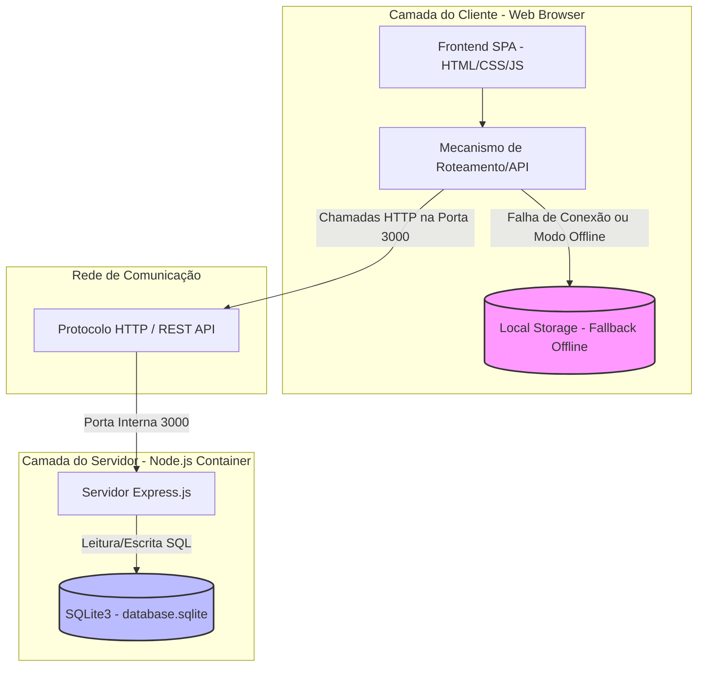
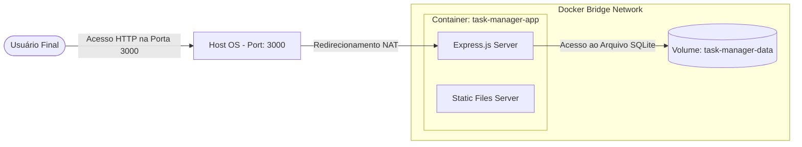

# 🌐 Arquitetura de Rede e Infraestrutura de Sistemas

Este documento descreve a topologia de rede, fluxos de comunicação, segurança e estrutura física/lógica do **Gerenciador de Tarefas Minimalista (Task Manager Kanban)**. Esta especificação deve servir de referência para desenvolvedores e administradores de sistema.

---

## 🏛️ Topologia Geral da Arquitetura

O sistema adota uma **arquitetura híbrida de rede** que permite o funcionamento tanto em modo Client-Server tradicional quanto em modo local (degradabilidade graciosa/offline fallback).

### Diagrama de Fluxo e Rede (Mermaid)



---

## 🔌 Protocolos de Comunicação e Endpoints

Toda a comunicação externa ocorre através do protocolo **HTTP/1.1** (ou HTTPS quando em produção sob TLS).

### Endpoints da API REST

A API do servidor escuta por padrão na porta `3000` (configurável via variável de ambiente `PORT`) e disponibiliza as seguintes rotas:

| Endpoint | Método | Descrição | Payload / Resposta |
|---|---|---|---|
| `/api/login` | `POST` | Autentica o usuário com criptografia `bcryptjs` | `{"username", "password"}` -> `{"message", "token"}` |
| `/api/tasks` | `GET` | Recupera todas as tarefas armazenadas | `[]` -> Lista de tarefas JSON |
| `/api/tasks` | `POST` | Cria uma nova tarefa no banco de dados | `{"id", "title", "completed", "status", "priorityColor", "createdAt"}` |
| `/api/tasks/:id` | `PUT` | Atualiza uma tarefa existente pelo ID | `{"completed", "status", "title", "priorityColor"}` |
| `/api/tasks/:id` | `DELETE`| Remove permanentemente uma tarefa | Resposta de confirmação de exclusão |
| `/api/columns` | `GET` | Recupera colunas do quadro Kanban | Lista de colunas JSON |
| `/api/columns` | `POST` | Cria ou atualiza uma coluna do Kanban | `{"id", "status", "name", "position"}` |
| `/api/columns/:status`| `DELETE`| Exclui uma coluna customizada do Kanban | Transfere tarefas órfãs de volta para a coluna 'todo' |
| `/api/version` | `GET` | Consulta a versão ativa e logs de migração | `{"version"}` |
| `/api/version` | `POST` | Realiza upgrade ou downgrade de versão | `{"version"}` -> Dispara migração SQLite |

---

## 🐳 Infraestrutura de Containers (Docker)

Quando executado via Docker Compose, o aplicativo é isolado em uma rede em ponte (*bridge network*) gerenciada pelo Docker Engine, garantindo segurança de borda.



### Detalhes do Ambiente Docker
- **Imagem Base:** `node:20` (definida no [Dockerfile](file:///c:/Users/Jefferson%20Byller/Documents/PI2Unifacisa-main/Dockerfile))
- **Mapeamento de Portas:** `3000:3000` (mapeia a porta física 3000 do host para a porta exposta 3000 do container)
- **Persistência de Dados:** Volume Docker mapeado em `/data` dentro do container, mantendo o arquivo `database.sqlite` seguro contra reinicializações do container.

---

## 🔒 Políticas de Segurança e CORS

1. **Cross-Origin Resource Sharing (CORS):**
   - Habilitado no backend via middleware `cors()` do Express para permitir requisições de outras origens durante o desenvolvimento.
   - Em produção, recomenda-se limitar o CORS apenas à origem confiável do cliente.
2. **Criptografia de Credenciais:**
   - As senhas nunca são trafegadas ou armazenadas em texto limpo.
   - A criptografia é implementada no backend usando o algoritmo de hash seguro `bcryptjs`.
3. **Resiliência e Desconexão:**
   - Caso a rede entre o Cliente e o Servidor falhe, o arquivo `api.js` (responsável pelo transporte HTTP) intercepta falhas de rede (`TypeError: Failed to fetch`) e aciona automaticamente a persistência em `localStorage`.

---

## 📁 Diagrama de Diretórios e Arquivos (Atualizado)

Abaixo está o mapeamento completo da estrutura física do repositório, detalhando as responsabilidades de cada componente:

```text
/ (Raiz do Projeto)
├── .agents/                      # Definições de agentes e workflows de vibe coding
│   └── workflows/
│       ├── arquiteto.md          # Diretrizes para design de sistemas e banco de dados
│       ├── arquitetura_de_rede.md # [ESTE ARQUIVO] Documentação de rede e topologia
│       ├── desenvolvedor.md      # Instruções de codificação e versionamento Git
│       ├── ideação.md            # Regras de negócio e concepção da persona do app
│       └── sysadmin.md           # Diretrizes para infraestrutura, Docker e Deploy
├── backend/                      # API REST em Node.js e banco de dados
│   ├── database.sqlite           # Banco de dados SQLite persistido localmente (fora do git)
│   ├── db.js                     # Configuração, criação das tabelas e população inicial do SQLite3
│   ├── package-lock.json         # Controle de dependências exatas do npm
│   ├── package.json              # Dependências e comandos de execução (Express, SQLite3, bcryptjs, etc.)
│   └── server.js                 # Arquivo central da API, rotas, controladores e serviços estáticos
├── frontend/                     # Interface do Usuário (SPA)
│   ├── index.html                # Tela inicial de autenticação
│   ├── tasks.html                # Página da lista de tarefas tradicional e minimalista
│   ├── kanban.html               # Página do painel Kanban interativo
│   ├── api.js                    # Biblioteca cliente HTTP/API com tratamento offline fallback
│   ├── auth.js                   # Lógica de controle de sessão e validação de login
│   ├── tasks.js                  # Lógica de interação da interface de lista de tarefas
│   ├── kanban.js                 # Lógica de ordenação, arrastar/soltar e customização de colunas
│   ├── version.js                # Lógica e logs do painel de controle de versão
│   ├── app.css                   # Estilização das interfaces principais (Temas Claro/Escuro/Midnight)
│   ├── global.css                # Variáveis CSS globais, definições de temas e resets
│   ├── login.css                 # Estilos específicos da tela de login
│   └── version.css               # Estilos para o painel flutuante de versionamento
├── .dockerignore                 # Filtro de arquivos ignorados no build da imagem Docker
├── .gitignore                    # Filtro de arquivos rastreados pelo controle de versão Git
├── Dockerfile                    # Arquivo de receita de construção da imagem Docker
├── docker-compose.yml            # Orquestrador para subir o container com volume persistente
├── git_manual.md                 # Guia prático de comandos e boas práticas de Git
├── MANUAL_VERSIONAMENTO.md       # Instruções e documentação do painel de versionamento
├── task.md                       # Kanban/Planejamento do projeto controlado por agentes
└── README.md                     # Manual principal de instalação e introdução do projeto
```
