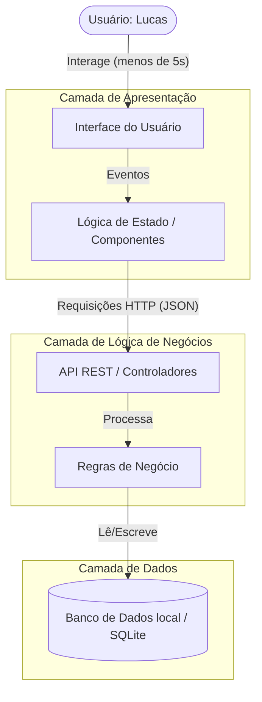

# Arquitetura do Sistema: Gerenciador de Tarefas Minimalista

Esta é a proposta de arquitetura de sistema para o "Gerenciador de Tarefas Minimalista", com foco em simplicidade, organização e escalabilidade futura, seguindo os princípios estabelecidos na fase de ideação.

## User Review Required

> [!IMPORTANT]
> Verifique a stack tecnológica proposta e decida se deseja utilizar LocalStorage (sem backend real) para máxima simplicidade inicial ou se prefere um Backend com Node.js e SQLite para já contemplar todas as camadas. A arquitetura abaixo prevê as 3 camadas completas (Frontend, Backend, Storage), mas pode ser simplificada caso prefira.

## Open Questions

> [!WARNING]
> 1. Para o Frontend, você prefere utilizar HTML/CSS/JS puro ou um framework moderno como React ou Vue?
> 2. Na modelagem de prioridades por cores, existe um padrão específico de cores que você já tem em mente (ex: Vermelho para Alta, Amarelo para Média, Verde para Baixa)?

## Proposed Changes

Abaixo estão as definições arquiteturais (Fase 2).

### 1. Diagrama de Arquitetura

O fluxo de dados ocorrerá da seguinte forma: o usuário interage com a Interface (Frontend), que se comunica via API REST com o Servidor (Backend), que por sua vez gerencia a persistência no Banco de Dados (Storage).



### 2. Modelagem de Dados (JSON Schema)

Estrutura principal da entidade `Task` (Tarefa), que garante escalabilidade para futuros atributos:

```json
{
  "$schema": "http://json-schema.org/draft-07/schema#",
  "title": "Task",
  "type": "object",
  "properties": {
    "id": {
      "type": "string",
      "description": "Identificador único da tarefa (UUID)"
    },
    "title": {
      "type": "string",
      "description": "Título/Descrição rápida da tarefa"
    },
    "completed": {
      "type": "boolean",
      "description": "Status de conclusão da tarefa"
    },
    "priorityColor": {
      "type": "string",
      "description": "Cor de prioridade (ex: '#FF0000' para alta)"
    },
    "createdAt": {
      "type": "string",
      "format": "date-time",
      "description": "Data e hora de criação"
    }
  },
  "required": ["id", "title", "completed", "createdAt"]
}
```

### 3. Estrutura de Pastas e Arquivos

Esta é a estrutura base recomendada para o repositório, separando as responsabilidades de forma que a aplicação possa crescer sem perder a organização:

```text
/
├── frontend/                 # Código do cliente (Interface Visual)
│   ├── public/               # Assets estáticos (ícones, imagens)
│   ├── src/
│   │   ├── components/       # Componentes de UI (TaskItem, TaskList, etc.)
│   │   ├── styles/           # Arquivos CSS ou tokens de design
│   │   ├── services/         # Integração com a API do backend
│   │   └── main.js/app.js    # Ponto de entrada do frontend
│   └── package.json
├── backend/                  # Código do servidor (API REST)
│   ├── src/
│   │   ├── controllers/      # Controladores de rotas (TaskController)
│   │   ├── models/           # Definição e modelagem dos dados
│   │   ├── routes/           # Mapeamento de endpoints (ex: /api/tasks)
│   │   └── server.js         # Inicialização do servidor
│   └── package.json
├── docs/                     # Documentações e diagramas do projeto
└── README.md                 # Apresentação do projeto para a entrega
```

## Verification Plan

### Manual Verification
- O usuário avaliará a proposta para confirmar se ela reflete a "Fase 2" (Arquitetura) de forma satisfatória e simples, atendendo ao perfil da persona "Lucas".
- Após aprovação ou ajustes nesta arquitetura, poderemos criar os arquivos e pastas e iniciar a Fase 3 (Produto Mínimo Viável).
