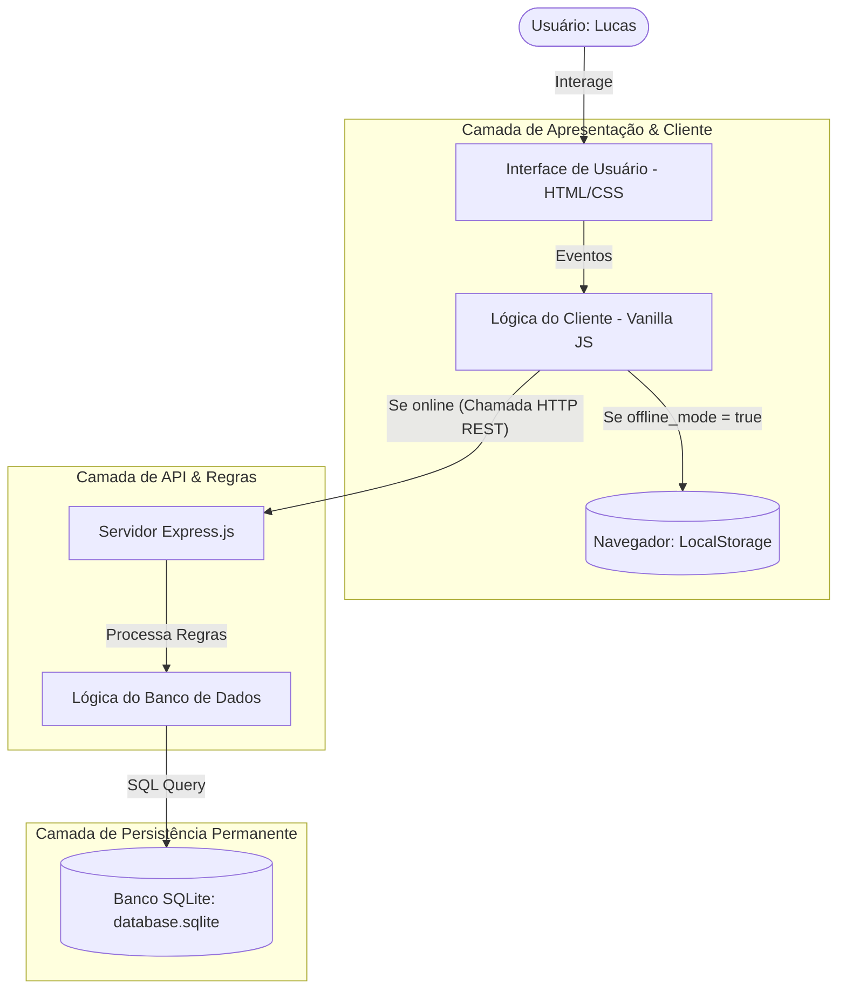

# Arquitetura do Sistema: Gerenciador de Tarefas Minimalista (Task Manager Kanban)

Este documento especifica a arquitetura técnica, fluxo de dados e modelagem de dados para o Gerenciador de Tarefas Minimalista, desenhado de forma a suportar execução híbrida (online/offline) de forma escalável e robusta em qualquer sistema operacional.

---

## 1. Diagrama de Arquitetura (Fluxo de Dados Híbrido)

A arquitetura do sistema foi projetada para operar em dois modos:
* **Modo Online (Padrão):** Onde o Frontend consome a API REST do Backend, persistindo os dados de forma permanente no banco de dados SQLite.
* **Modo Offline (Fallback):** Onde a interface consome e grava dados diretamente na camada do `localStorage` do navegador caso o backend esteja indisponível.


```mermaid
graph TD
    User([Usuário: Lucas])
    
    subgraph Frontend [Camada de Apresentação & Cliente]
        UI[Interface de Usuário - HTML/CSS]
        Logic[Lógica do Cliente - Vanilla JS]
        LocalDB[(Navegador: LocalStorage)]
    end
    
    subgraph Backend [Camada de API & Regras]
        API[Servidor Express.js]
        DBService[Lógica do Banco de Dados]
    end
    
    subgraph Storage [Camada de Persistência Permanente]
        SQLite[(Banco SQLite: database.sqlite)]
    end

    %% Fluxo de interações
    User -- Interage --> UI
    UI -- Eventos --> Logic
    
    %% Decisão de persistência
    Logic -- "Se offline_mode = true" --> LocalDB
    Logic -- "Se online (Chamada HTTP REST)" --> API
    
    API -- Processa Regras --> DBService
    DBService -- SQL Query --> SQLite
```

---

## 2. Estrutura de Pastas e Arquivos Real

A organização do repositório separa claramente a camada de visualização (Front-end) da camada de dados e negócio (Back-end) sem adicionar complexidades de frameworks pesados:

```text
/ (Raiz do Workspace)
├── .agents/                  # Workflows e definições dos agentes de IA
│   └── workflows/
│       ├── arquiteto.md      # Papel e instruções do Arquiteto de Rede
│       ├── desenvolvedor.md  # Diretrizes de desenvolvimento do Dev-Agent
│       └── ideiação.md        # Concepção inicial do projeto
├── backend/                  # Código do Servidor
│   ├── node_modules/         # Dependências do NodeJS (instaladas localmente)
│   ├── db.js                 # Script de inicialização e tabelas SQLite
│   ├── server.js             # Endpoints REST (/api/login, /api/tasks)
│   ├── package.json          # Manifesto do backend com dependências cross-platform
│   └── database.sqlite       # Arquivo de banco de dados SQLite (Ignorado no Git)
├── frontend/                 # Código do Cliente
│   ├── index.html            # Tela de login
│   ├── tasks.html            # Interface de lista de tarefas
│   ├── kanban.html           # Interface do painel Kanban
│   ├── app.css               # Estilos da aplicação principal
│   ├── global.css            # Variáveis globais, fontes e resets
│   ├── login.css             # Estilo específico para a tela de login
│   ├── api.js                # URL base e funções utilitárias compartilhadas
│   ├── auth.js               # Gerenciamento de sessão e tokens locais
│   ├── login.js              # Lógica de login e fallback
│   ├── tasks.js              # Gerenciamento da lista de tarefas e persistência local
│   └── kanban.js             # Lógica e movimentação dos cards no Kanban
├── .gitignore                # Regras para evitar versionar arquivos desnecessários
├── README.md                 # Documentação principal e guia rápido
├── implementation_plan.md    # Este documento de arquitetura
└── task.md                   # Controle e checklist do progresso
```

---

## 3. Modelagem de Dados (JSON Schema)

A entidade principal do sistema é a `Task` (Tarefa), representada pelo seguinte esquema JSON, que garante a consistência das propriedades tanto no `localStorage` quanto nas tabelas do `SQLite`:

```json
{
  "$schema": "http://json-schema.org/draft-07/schema#",
  "title": "Task",
  "type": "object",
  "properties": {
    "id": {
      "type": "string",
      "description": "Identificador único da tarefa (UUID gerado no front-end)"
    },
    "title": {
      "type": "string",
      "description": "Título ou descrição da tarefa"
    },
    "completed": {
      "type": "boolean",
      "description": "Status de conclusão (true se finalizada, false caso contrário)"
    },
    "status": {
      "type": "string",
      "enum": ["todo", "doing", "done"],
      "description": "Coluna do painel Kanban onde a tarefa se encontra"
    },
    "priorityColor": {
      "type": "string",
      "description": "Cor hexadecimal correspondente à prioridade"
    },
    "createdAt": {
      "type": "string",
      "format": "date-time",
      "description": "Data e hora de criação no formato ISO"
    }
  },
  "required": ["id", "title", "completed", "status", "priorityColor", "createdAt"]
}
```

---

## 4. Plano de Verificação da Infraestrutura

Para certificar-se de que a arquitetura está rodando de forma saudável:
* **Ambiente Online:** Inicie o backend (`npm start`) e verifique se as requisições para `/api/tasks` estão respondendo status 200 OK.
* **Ambiente Offline (Resiliência):** Interrompa o backend (Ctrl+C). Adicione uma nova tarefa no front-end e atualize a página. A tarefa deve persistir no painel devido à ativação automática do fluxo local (`saveToLocal` / `localStorage`).
